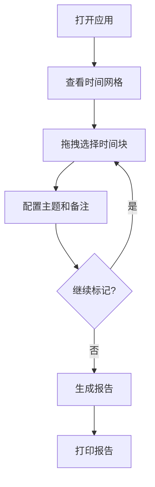

## 1. 产品概述
时间记录器是一款桌面端应用程序，帮助用户可视化记录和管理白天时间（5:00-22:00）。通过5分钟间隔的网格系统，用户可以直观地标记时间块，添加主题和备注，并生成每日报告。

目标用户：需要时间管理和记录的个人用户，如自由职业者、学生、工作效率提升者。

## 2. 核心功能

### 2.1 用户角色
无需用户注册，单机使用，所有数据本地存储。

### 2.2 功能模块
时间记录器包含以下核心页面：
1. **主界面**：时间网格显示、时间块选择、主题配置
2. **报告界面**：每日报告预览、打印功能

### 2.3 页面详情
| 页面名称 | 模块名称 | 功能描述 |
|---------|---------|---------|
| 主界面 | 时间网格 | 显示5:00-22:00时间段，每5分钟一个小格子，共204个格子 |
| 主界面 | 时间选择 | 鼠标拖拽选择连续的时间块，支持多段选择 |
| 主界面 | 主题配置弹窗 | 设置选中时间块的主题颜色、添加备注信息 |
| 主界面 | 顶部工具栏 | 显示当前日期、快速导航、报告生成按钮 |
| 报告界面 | 报告预览 | 显示当日时间分配统计、主题分布、备注内容 |
| 报告界面 | 打印功能 | 一键生成A4格式PDF，支持直接打印 |

## 3. 核心流程
用户使用流程：
1. 打开应用，查看当日时间网格
2. 鼠标拖拽选择要标记的时间块
3. 在弹窗中选择主题颜色，输入备注信息
4. 重复操作，完成全天时间标记
5. 点击生成报告，查看当日时间分配
6. 选择打印，输出A4格式报告

## 4. 用户界面设计

### 4.1 设计风格
- **主色调**：浅灰色背景（#F5F5F5），白色网格
- **主题颜色**：提供8种预设颜色（蓝色、绿色、橙色、红色、紫色、青色、黄色、粉色）
- **按钮样式**：圆角矩形，轻微阴影效果
- **字体**：系统默认字体，标题14px，正文12px
- **布局**：网格布局为主，顶部工具栏固定

### 4.2 页面设计
| 页面名称 | 模块名称 | UI元素 |
|---------|---------|---------|
| 主界面 | 时间网格 | 12列网格布局，每列代表1小时，行高20px，格子间距2px，悬停效果 |
| 主界面 | 主题弹窗 | 居中模态框，300px宽，包含颜色选择器、文本输入框、确认按钮 |
| 主界面 | 工具栏 | 顶部固定，高度40px，包含日期选择器、导航按钮、报告按钮 |
| 报告界面 | 报告内容 | 卡片式布局，包含时间统计图表、主题分布饼图、备注列表 |

### 4.3 响应式设计
桌面端专用应用，固定窗口大小（1200x800px），不考虑移动端适配。

### 4.4 交互细节
- 鼠标拖拽时显示半透明选择框
- 已标记时间块显示对应颜色，悬停显示备注
- 支持Ctrl+Z撤销操作
- 双击已标记块可重新编辑