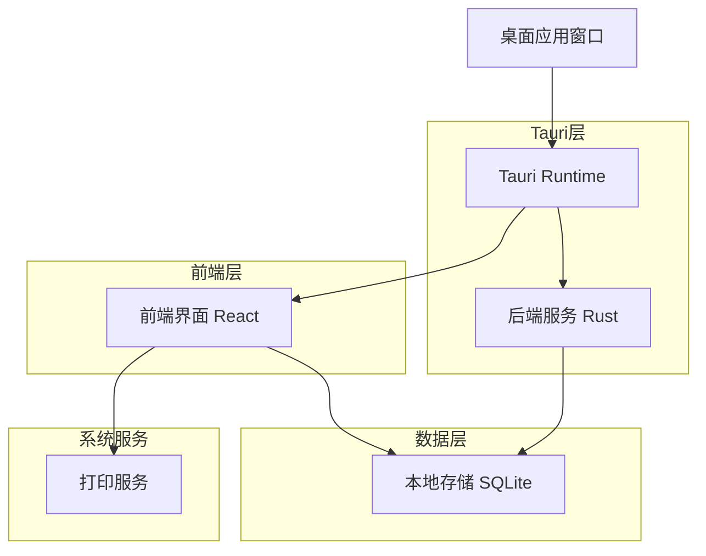
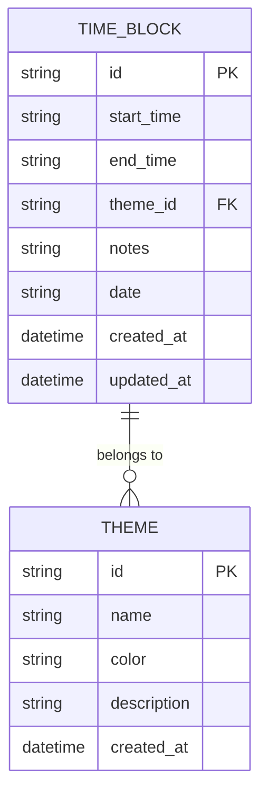

## 1. 架构设计



## 2. 技术描述

- **前端框架**: React@18 + TypeScript + Vite
- **初始化工具**: vite-init
- **UI库**: TailwindCSS@3 + HeadlessUI
- **桌面框架**: Tauri@1.0
- **后端语言**: Rust (Tauri内置)
- **数据库**: SQLite (本地文件存储)
- **状态管理**: React Context + useReducer
- **图表库**: Chart.js (用于报告统计)

## 3. 路由定义

| 路由 | 用途 |
|-----|------|
| / | 主界面，时间网格显示 |
| /report | 报告界面，显示当日统计 |
| /settings | 设置界面，主题颜色配置 |

## 4. 核心数据结构

### 4.1 时间块数据结构
```typescript
interface TimeBlock {
  id: string;
  startTime: string; // HH:mm 格式
  endTime: string;   // HH:mm 格式
  theme: string;     // 主题ID
  notes: string;     // 备注内容
  date: string;      // YYYY-MM-DD 格式
}

interface Theme {
  id: string;
  name: string;
  color: string;     // HEX颜色值
  description?: string;
}
```

### 4.2 报告数据结构
```typescript
interface DailyReport {
  date: string;
  totalBlocks: number;
  themeStats: {
    themeId: string;
    totalMinutes: number;
    percentage: number;
  }[];
  blocks: TimeBlock[];
}
```

## 5. Tauri命令定义

### 5.1 数据存储命令
```rust
// 保存时间块
#[tauri::command]
async fn save_time_block(block: TimeBlock) -> Result<String, String>

// 获取指定日期的时间块
#[tauri::command]
async fn get_time_blocks(date: String) -> Result<Vec<TimeBlock>, String>

// 删除时间块
#[tauri::command]
async fn delete_time_block(id: String) -> Result<bool, String>
```

### 5.2 报告生成命令
```rust
// 生成每日报告
#[tauri::command]
async fn generate_daily_report(date: String) -> Result<DailyReport, String>

// 导出PDF报告
#[tauri::command]
async fn export_pdf_report(report: DailyReport, output_path: String) -> Result<bool, String>
```

## 6. 数据模型

### 6.1 数据库表结构


### 6.2 数据库定义语言
```sql
-- 时间块表
CREATE TABLE time_blocks (
    id TEXT PRIMARY KEY,
    start_time TEXT NOT NULL,
    end_time TEXT NOT NULL,
    theme_id TEXT NOT NULL,
    notes TEXT DEFAULT '',
    date TEXT NOT NULL,
    created_at DATETIME DEFAULT CURRENT_TIMESTAMP,
    updated_at DATETIME DEFAULT CURRENT_TIMESTAMP
);

-- 主题表
CREATE TABLE themes (
    id TEXT PRIMARY KEY,
    name TEXT NOT NULL,
    color TEXT NOT NULL,
    description TEXT,
    created_at DATETIME DEFAULT CURRENT_TIMESTAMP
);

-- 创建索引
CREATE INDEX idx_time_blocks_date ON time_blocks(date);
CREATE INDEX idx_time_blocks_theme ON time_blocks(theme_id);

-- 初始化主题数据
INSERT INTO themes (id, name, color, description) VALUES
('work', '工作', '#3B82F6', '工作相关活动'),
('study', '学习', '#10B981', '学习和阅读'),
('rest', '休息', '#F59E0B', '休息和放松'),
('exercise', '运动', '#EF4444', '运动和健身'),
('social', '社交', '#8B5CF6', '社交活动'),
('hobby', '爱好', '#06B6D4', '个人爱好'),
('meal', '用餐', '#F97316', '用餐时间'),
('other', '其他', '#6B7280', '其他活动');
```

## 7. 组件架构

### 7.1 前端组件结构
```
src/
├── components/
│   ├── TimeGrid/          # 时间网格组件
│   ├── ThemeSelector/     # 主题选择器
│   ├── TimeBlockModal/    # 时间块编辑弹窗
│   ├── ReportView/        # 报告视图
│   └── PrintPreview/      # 打印预览
├── hooks/
│   ├── useTimeBlocks.ts   # 时间块状态管理
│   ├── useThemes.ts       # 主题管理
│   └── useReport.ts       # 报告生成
├── services/
│   ├── tauri.ts           # Tauri命令封装
│   └── storage.ts         # 本地存储服务
└── utils/
    ├── time.ts            # 时间处理工具
    └── pdf.ts             # PDF生成工具
```

### 7.2 状态管理设计
使用React Context管理全局状态：
- TimeBlockContext: 管理时间块数据
- ThemeContext: 管理主题配置
- DateContext: 管理当前选中日期